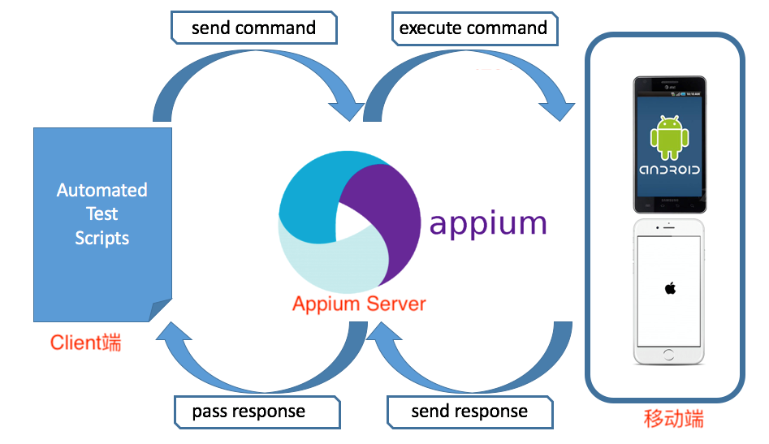

### appium自动化工具的实现流程



- Client端 就是运行编写的自动化项目代码，使用Appium-client提供的API来进行用例的编写。通过 Appium Server 去创建一个Android的session会话。
- Appium Server启动时默认的占用的端口号为4723，主要作用就是进行API请求的监听。Appium Server端接收到移动设备返回的结果再将操作结果发送给Client端。
- Android移动端 Appium 基于JSON Wire协议，通过调用UIAutomatior命令，实现APP的自动化测试。

总结：
客户端发送请求给Appium Server，Appium Server转换请求给移动端，在移动端操作完成后返回响应内容给Appium Server，Appium Server再把结果返回给客户端。

### 常见问题

- 所以如果我要群控10台设备，需要启动10个appium server来进行分配是吗？

> 1. 单个Appium Server，多个会话
> 2. 多个Appium Server实例
> 3. 使用Appium的并行工具

- 单个Appium Server，多个会话，实际上做了什么

> 如何工作的？
> 当你启动一个会话时，你会向Appium Server发送一个包含设备和应用配置的请求（称为Desired Capabilities）。Appium
> Server根据这些配置创建一个会话，并将其与一个特定的设备关联。即使所有会话都通过同一个端口（例如4723）与服务器通信，Appium也能够管理这些会话，并确保命令被发送到正确的设备。

> 会话：每个会话都是独立的，与特定的设备关联。你可以同时拥有多个活跃的会话，每个会话控制一个设备。
> 端口：虽然所有通信都通过一个端口（默认是4723），但Appium内部使用设备标识符（如UDID）来区分不同的会话和设备。

> 也就是说只开 一个 4723 端口是可以多开实例的。

- 怎么下载app里面的图片、视频？

> 最便捷的方法还是要使用adb 将文件下载到本地然后再上传到服务器，返回一个url文件链接喂给chatgpt。

---

### 一、安装 Appium-Python-Client，版本要求3.0及以上 和 Selenium 版本要求4.0及以上

```shell
pip install Appium-Python-Client
pip install selenium
```

### 二、编写自动化脚本

```python
from appium import webdriver
from appium.options.common.base import AppiumOptions


class WhatsAppAutomation:
    def __init__(self, appium_port, device_port, platform_version):
        """
        初始化方法，设置设备名称和Appium服务器端口。
        """

        self.appium_port = appium_port
        self.device_name = device_port
        self.platform_version = platform_version
        self.driver = self.create_driver()

    def create_driver(self):
        """
        创建并返回一个webdriver实例，用于与Appium服务器交互。
        """
        options = AppiumOptions()
        options.load_capabilities({
            "automationName": "uiautomator2",
            "platformName": "Android",
            "platformVersion": self.platform_version,
            "deviceName": self.device_name,
            "udid": self.device_name,
            "appPackage": "com.whatsapp",
            "appActivity": "com.whatsapp.HomeActivity",
            "noReset": True,
            "fullReset": False
        })
        appium_host = f'http://127.0.0.1:{self.appium_port}'
        return webdriver.Remote(appium_host, options=options)
```

### 三、元素定位方式

- 根据id定位

```python
el = driver.find_element(AppiumBy.ID, "com.estrongs.android.pop:id/txt_grant")
el.click()
```

- 根据xpath定位

```python
el1 = driver.find_element(AppiumBy.XPATH, '//android.widget.TextView[@resource-id="android:id/title" and @text="密码设置"]')
el1.click()
```

- 根据class定位 (建议少用，重复名称较多)

```python
el3 = driver.find_element(AppiumBy.CLASS_NAME, "android.widget.ImageButton")
el3.click()
```

更多操作参考：[https://blog.csdn.net/qq_45664055/article/details/134712607?spm=1001.2014.3001.5502](https://blog.csdn.net/qq_45664055/article/details/134712607?spm=1001.2014.3001.5502)

