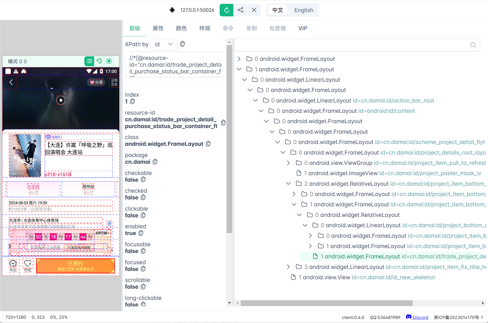

appium 响应速度太慢的问题经常被人所诟病，uiautomator2是一个更快的替代方案。

### 安装 uiautomator2

[https://github.com/openatx/uiautomator2](https://github.com/openatx/uiautomator2)

- Android版本 4.4+
- Python 3.8+

1、安装UIAutomator2，用于安卓设备的驱动程序。

先准备一台（不要两台）开启了开发者选项的安卓手机，连接上电脑，确保执行adb devices可以看到连接上的设备。

```shell
pip install uiautomator2
```

2、初始化uiautomator2

```shell
uiautomator2 init --mirror --serial $SERIAL
```

$SERIAL 就是连接设备的序列号，可以通过 adb devices 查看。

3、基本使用

```python
import uiautomator2 as u2

d = u2.connect() # connect to device
print(d.info)
```
这时看到类似下面的输出，就可以正式开始用我们这个库了。因为这个库功能太多，后面还有很多的内容，需要慢慢去看

```shell
{'currentPackageName': 'com.android.launcher', 'displayHeight': 1920, 'displayRotation': 0, 'displaySizeDpX': 360, 'displaySizeDpY': 640, 'displayWidth': 1080, 'productName': 'odin', 'screenOn': True, 'sdkInt': 29, 'naturalOrientation': True}
```
4、快速参考

```python
import uiautomator2 as u2

d = u2.connect("--serial-here--")  # 只有一个设备也可以省略参数
d = u2.connect()  # 一个设备时, read env-var ANDROID_SERIAL

d.app_current()  # 获取前台应用 packageName, activity
d.app_start("io.appium.android.apis")  # 启动应用
d.app_start("io.appium.android.apis", stop=True)  # 启动应用前停止应用
d.app_stop("io.appium.android.apis")  # 停止应用

app = d.session("io.appium.android.apis")  # 启动应用并获取session

# session的用途是操作的同时监控应用是否闪退，当闪退时操作，会抛出SessionBrokenError
app.click(10, 20)  # 坐标点击

# 无session状态下操作
d.click(10, 20)  # 坐标点击
d.swipe(10, 20, 80, 90)  # 从(10, 20)滑动到(80, 90)
d.swipe_ext("right")  # 整个屏幕右滑动
d.swipe_ext("right", scale=0.9)  # 屏幕右滑，滑动距离为屏幕宽度的90%

d.press("back")  # 模拟点击返回键
d.press("home")  # 模拟Home键

d.send_keys("hello world")  # 模拟输入，需要光标已经在输入框中才可以
d.clear_text()  # 清空输入框

# 元素操作
d.xpath("立即开户").wait()  # 等待元素，最长等10s（默认）
d.xpath("立即开户").wait(timeout=10)  # 修改默认等待时间

# 常用配置
d.settings['wait_timeout'] = 20  # 控件查找默认等待时间(默认20s)

# xpath操作
d.xpath("立即开户").click()  # 包含查找等待+点击操作，匹配text或者description等于立即开户的按钮
d.xpath("//*[@text='私人FM']/../android.widget.ImageView").click()

for el in d.xpath('//android.widget.EditText').all():
    print("rect:", el.rect)  # output tuple: (left_x, top_y, width, height)
    print("bounds:", el.bounds)  # output tuple: （left, top, right, bottom)
    print("center:", el.center())
    el.click()  # click operation
    print(el.elem)  # 输出lxml解析出来的Node

# 监控弹窗(在线程中监控)
d.watcher.when("跳过").click()
d.watcher.start()
```

更多用法：https://github.com/openatx/uiautomator2/blob/master/README.md

### uiauto.dev 帮助你快速编写 AppUI 自动化脚本（UI Inspector）

它由网页端+客户端组成的 UI Inspector 元素定位器。

- 支持Android和iOS
- 支持鼠标选择控件查看属性，控件树辅助精确定位，生成选择器
- 支持找色功能，方向键微调坐标，获取RGB、HSB

安装与启动：

```shell
pip3 install -U uiautodev -i https://pypi.doubanio.com/simple

uiauto.dev
```
uiauto.dev 正常启动后，刷新网页即可。



这是一个开源项目，demo 可以在： [https://uiauto.devsleep.com/demo/12345](https://uiauto.devsleep.com/demo/12345)


> 另：weditor 已经被废弃，不再维护，不要给自己找麻烦。